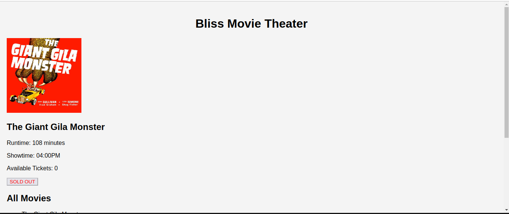
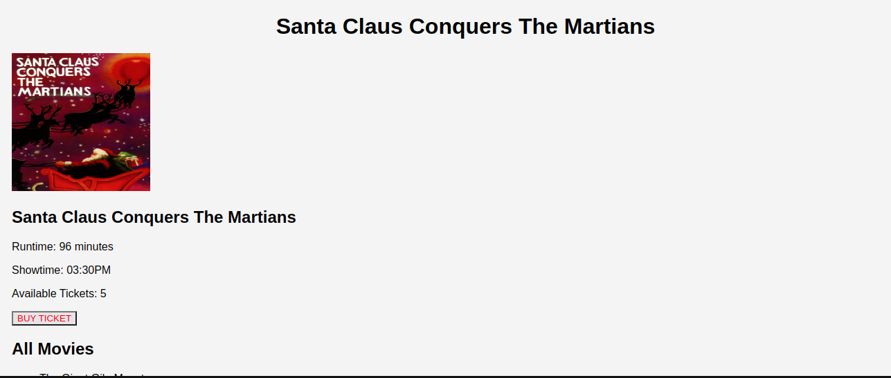
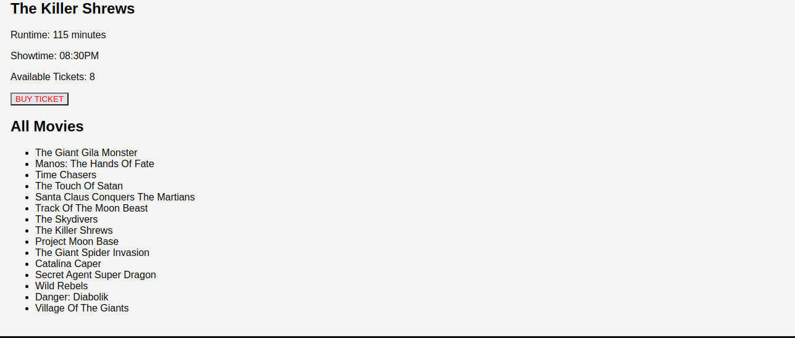

## code-challenge-week-3
## Author- Collins Kipkorir
## BLISS MOVIE-THEATER
Bliss Movie-Theater is a web application where users can choose the type of movies they would like to watch and allows them to buy tickets, know the remaining tickets available, if the tickets of the Movie they would like to watch is sold out, also it helps them knowing the run-time of the movie and also the showtime.
## Technologies used
HTML and CSS for the front-end user interface. JavaScript for DOM manipulation and event handling. Jason-server for providing the back-end data.
## SCREENSHOTS OF THE BLISS MOVIE-THEATER WEB

## Support and contact details 
To make a contribution to the code used or any suggestions you can click on the contact link and email me your suggestions.
    • Email: kipkorirc583@gmail.com
## License
 Copyright (c) 2023 Collins Kipkorir.

Permission is hereby granted, free of charge, to any person obtaining a copy of this software and associated documentation files , to deal in the Software without restriction, including without limitation the rights to use, copy, modify, merge, publish, distribute, sublicense, and/or sell copies of the Software, and to permit persons to whom the Software is furnished to do so, subject to the following conditions:
The above copyright notice and this permission notice shall be included in all copies or substantial portions of the Software.
THE SOFTWARE IS PROVIDED "AS IS", WITHOUT WARRANTY OF ANY KIND, EXPRESS OR IMPLIED, INCLUDING BUT NOT LIMITED TO THE WARRANTIES OF MERCHANTABILITY, FITNESS FOR A PARTICULAR PURPOSE AND NONINFRINGEMENT. IN NO EVENT SHALL THE AUTHORS OR COPYRIGHT HOLDERS BE LIABLE FOR ANY CLAIM, DAMAGES OR OTHER LIABILITY, WHETHER IN AN ACTION OF CONTRACT, TORT OR OTHERWISE, ARISING FROM, OUT OF OR IN CONNECTION WITH THE SOFTWARE OR THE USE OR OTHER DEALINGS IN THE SOFTWARE.
